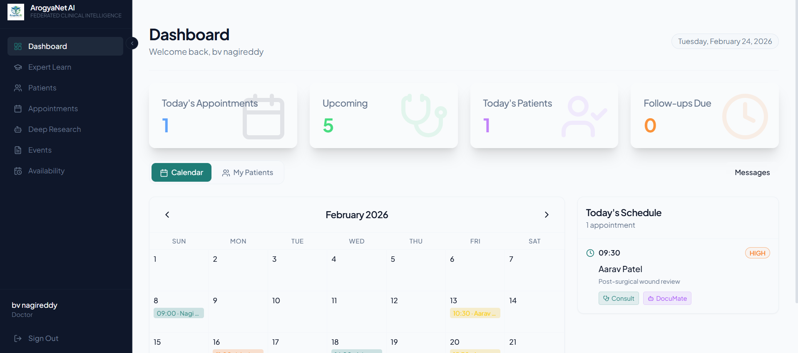
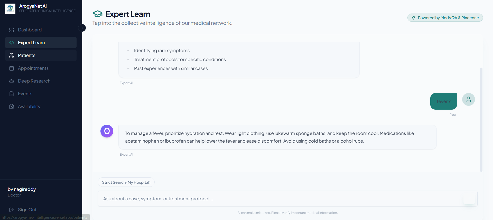
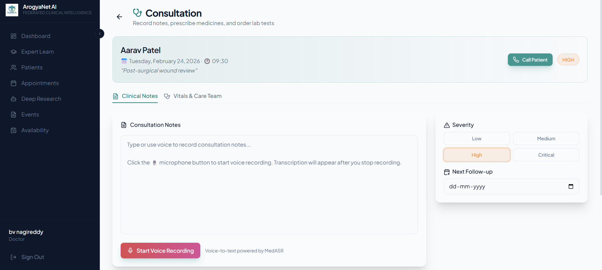
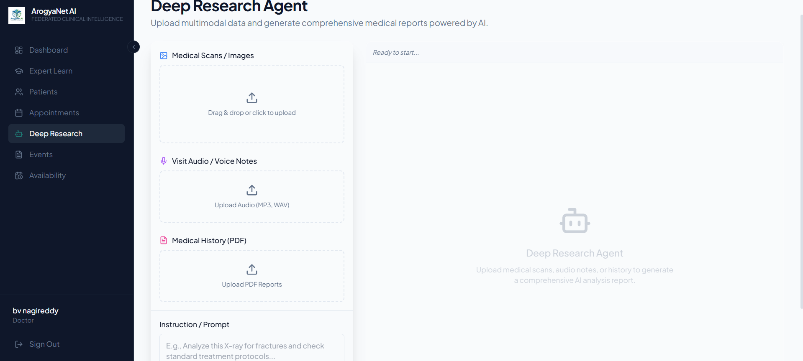
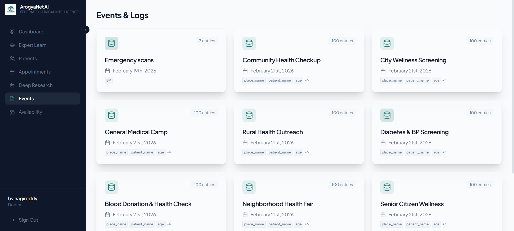
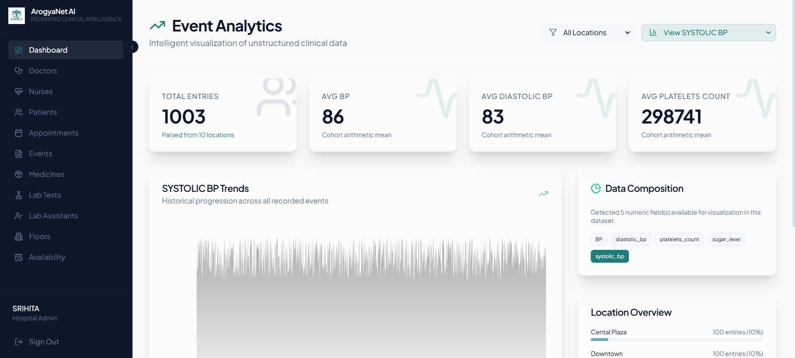
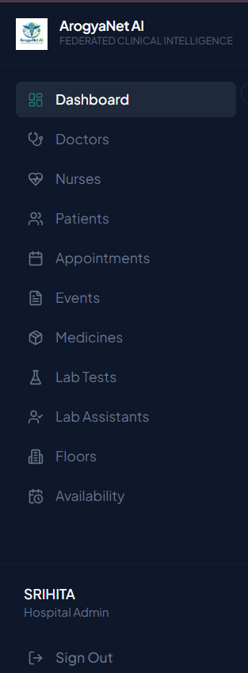
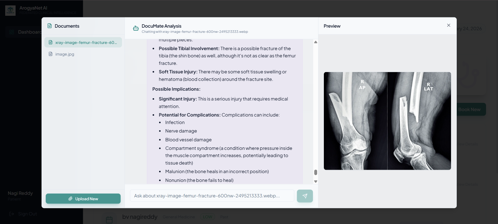
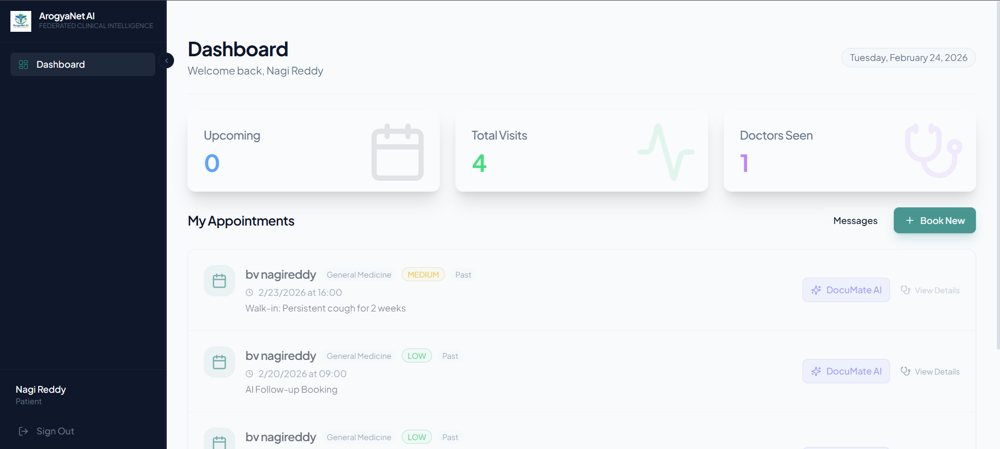
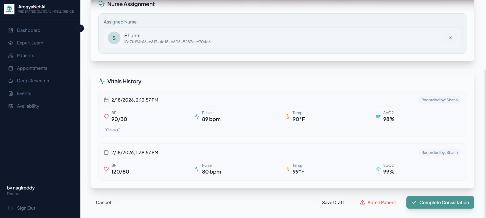

# 🏥 ArogyaNet AI — Federated Clinical Intelligence (Frontend)

> The **web dashboard** powering ArogyaNet AI — a multi-role clinical intelligence platform for doctors, admins, nurses, and patients. Built with React, TypeScript, and a custom glassmorphism design system.

[](https://react.dev)
[](https://typescriptlang.org)
[](https://vitejs.dev)
[](https://tailwindcss.com)
[](LICENSE)

---

## 📌 Purpose

ArogyaNet AI's frontend provides a **unified, role-aware dashboard** for the entire clinical workflow — from doctor consultations and AI-driven diagnostics to nurse vitals collection, patient self-service, and hospital administration. It interfaces with the [ArogyaNet Backend](https://github.com/nagireddy5/life-health-crm) for AI agent orchestration, data persistence, and real-time communication.

---

## ✨ Platform Features

### 1. 🩺 Doctor Dashboard

A command center for physicians — view today's appointments, upcoming schedule, patient stats, calendar, and daily schedule at a glance.

<p align="center">
  
</p>

---

### 2. 🧠 Expert Learn (AI Knowledge Assistant)

AI-powered medical knowledge chat backed by **MedVQA & Pinecone** vector search. Doctors can ask about symptoms, treatment protocols, rare conditions, and get answers derived from senior clinicians' contributions.

- Hospital-specific strict search mode
- Streaming responses with medication & lab test metadata

<p align="center">
  
</p>

---

### 3. 📞 Consultation Agent

Full consultation management with **voice recording (MedASR)**, patient calling, clinical notes, severity tracking, and follow-up scheduling — all in a single screen.

- Start voice recording → AI transcribes to clinical notes
- Call patient directly via **LiveKit + Gemini Realtime Audio**
- Set severity: Low / Medium / High / Critical
- Schedule next follow-up date

<p align="center">
  
</p>

---

### 4. 🔬 Deep Research Agent (Multi-Agent Analysis)

Upload medical scans, audio notes, or PDF histories. The **multi-agent system** activates — MedVQA analyzes images, MedASR transcribes audio, HeAR processes acoustics, MedSigLIP classifies, and Tavily fetches the latest research. All synthesized into a comprehensive AI report via **LangGraph**.

- Supports image + audio + PDF simultaneously
- Real-time SSE streaming with step-by-step status
- Final synthesis by Llama 3.3 70B

<p align="center">
  
</p>

---

### 5. 📋 Events & Logs

Track community health events, medical camps, wellness screenings, and outreach programs. Each event captures structured patient data with location, demographics, and vitals.

<p align="center">
  
</p>

---

### 6. 📊 Event Analytics (Admin)

Intelligent visualization of unstructured clinical data for hospital admins. Monitor BP trends, platelet counts, sugar levels, and location-wise breakdowns. **Spike detection** enables rapid response to anomalies.

- Filter by location, metric type
- Historical progression charts
- Data composition overview

<p align="center">
  
</p>

---

### 7. 🏢 Admin Portal

Full hospital administration — manage doctors, nurses, patients, appointments, medicines, lab tests, lab assistants, and floor assignments from a centralized portal.

<p align="center">
  
</p>

---

### 8. 📑 DocuMate Agent (Document Intelligence)

AI-powered document analysis agent. Upload X-rays, lab reports, or medical images — get instant AI summaries, critical value highlights, and a chat interface to ask follow-up questions about your documents.

- Supports PDF, images (X-ray, CT, MRI)
- Per-document chat with streaming responses
- Document preview panel

<p align="center">
  
</p>

---

### 9. 👤 Patient Dashboard

Patients can view upcoming visits, total visit history, book new consultations, access **DocuMate AI** for report analysis, and manage their healthcare journey.

<p align="center">
  
</p>

---

### 10. 💉 Nurse Vitals & Care

Nurse assignment tracking with complete vitals history — BP, pulse, temperature, SpO2 — recorded and timestamped per visit. Supports the **offline-first mobile workflow** for field healthcare.

<p align="center">
  
</p>

---

## 🔐 Role-Based Access Control

The dashboard dynamically adapts based on the authenticated user's role:

| Role | Dashboard Features |
|------|-------------------|
| **Hospital Admin** | Event analytics, doctor/nurse/patient management, medicines, lab tests, floors, appointments |
| **Doctor** | Calendar, patients, consultations, Expert Learn, Deep Research, Events, availability, documents |
| **Nurse** | Patient vitals collection, appointment vitals logging, assigned patients |
| **Patient** | Appointment history, book new visits, DocuMate AI for reports |

---

## 🧠 AI Agent Integration

The frontend connects to **5 specialized AI agents** running on the backend:

| Agent | Frontend Feature | How It's Used |
|-------|-----------------|---------------|
| **MedVQA** (MedGemma) | DocuMate, Deep Research | Medical image & document analysis |
| **MedASR** | Consultation | Real-time voice transcription during consultations |
| **HeAR** | Deep Research | Acoustic health embeddings from patient audio |
| **MedSigLIP** | Deep Research | Zero-shot medical image classification |
| **ExpertAgent** (Pinecone) | Expert Learn | Semantic search across expert knowledge base |
| **CallAgent** (LiveKit) | Consultation | AI receptionist outbound voice calls |
| **SummarizeAgent** (Gemini) | Appointments | Smart triage & appointment suggestion |
| **DietPlanner** (Gemini) | Consultation | AI-generated personalized diet plans |

---

## 💎 Design System

The application uses a custom **Modern Organic** glassmorphism design system with a dark sidebar theme:

- **Glass Cards & Modals** — Backdrop-blur surfaces with subtle translucent borders
- **Animated Buttons** — Shimmer effects and scale transitions
- **Responsive Layout** — Collapsible sidebar, fluid grid, mobile-friendly
- **Dark Theme Sidebar** — Consistent navigation with role-aware menu items
- **Micro-animations** — Smooth transitions, loading skeletons, hover effects

---

## 🛠️ Tech Stack

| Layer | Technology |
|-------|-----------|
| **Framework** | React 18 + TypeScript |
| **Build Tool** | Vite 5 |
| **Styling** | Tailwind CSS 3 + Custom design tokens |
| **UI Components** | shadcn/ui (Radix primitives) |
| **State / Data** | TanStack React Query + React Context |
| **Routing** | React Router v6 |
| **Auth** | JWT + Google OAuth |
| **Real-time** | WebSockets (voice), SSE (AI streaming) |
| **Charts** | Recharts |
| **Backend** | [ArogyaNet Backend](https://github.com/nagireddy5/life-health-crm) (FastAPI) |

---

## 🚀 Quick Start

### Prerequisites
- Node.js 18+ & npm
- ArogyaNet Backend running (see [Backend README](https://github.com/nagireddy5/life-health-crm))

### Installation

```bash
# Clone the repository
git clone https://github.com/Niteesh57/life-health-secure-access.git
cd life-health-secure-access

# Install dependencies
npm install

# Configure environment
cp .env.example .env
# Edit .env with your API URL

# Start development server
npm run dev
```

### Environment Variables

```env
VITE_API_URL=http://localhost:7860/api/v1
```

### Production Build

```bash
npm run build
npm run preview
```

---

## 📂 Project Structure

```
life-health-secure-access/
├── public/
│   ├── img/                    # Feature screenshots
│   ├── nav/                    # Login slideshow images
│   └── icon.png                # App logo
├── src/
│   ├── App.tsx                 # Root component + routing
│   ├── main.tsx                # Vite entry point
│   ├── index.css               # Global styles + design tokens
│   ├── pages/                  # Page-level views
│   │   ├── Index.tsx           # Login / Sign Up / Hospital Registration
│   │   ├── FeaturesPreview.tsx # Public feature showcase
│   │   ├── Dashboard.tsx       # Role-aware dashboard (Doctor / Admin / Nurse / Patient)
│   │   ├── Consultation.tsx    # Doctor consultation with voice + AI
│   │   ├── ExpertLearn.tsx     # AI knowledge assistant
│   │   ├── DeepResearch.tsx    # Multi-agent research tool
│   │   ├── Documents.tsx       # DocuMate document analysis
│   │   ├── Events.tsx          # Events & community health logs
│   │   ├── Appointments.tsx    # Appointment management
│   │   ├── Patients.tsx        # Patient records
│   │   ├── NurseDashboard.tsx  # Nurse vitals & patient care
│   │   ├── Doctors.tsx         # Admin — Doctor management
│   │   ├── Nurses.tsx          # Admin — Nurse management
│   │   ├── Medicines.tsx       # Admin — Medicine inventory
│   │   ├── LabTests.tsx        # Admin — Lab test definitions
│   │   ├── LabReports.tsx      # Lab report management
│   │   ├── LabAssistants.tsx   # Admin — Lab staff management
│   │   ├── Floors.tsx          # Admin — Hospital floors
│   │   ├── Availability.tsx    # Doctor availability slots
│   │   ├── Profile.tsx         # User profile management
│   │   └── Onboarding.tsx      # First-time setup
│   ├── components/             # Reusable UI components (60+)
│   │   ├── DashboardLayout.tsx # Sidebar + main content layout
│   │   ├── ProtectedRoute.tsx  # Auth guards (role-based)
│   │   └── ui/                 # shadcn/ui primitives
│   ├── contexts/
│   │   └── AuthContext.tsx     # JWT auth state management
│   ├── hooks/                  # Custom React hooks
│   └── lib/
│       └── api.ts              # Axios API client
├── index.html                  # HTML entry point
├── vite.config.ts              # Vite configuration
├── tailwind.config.ts          # Tailwind theme + custom tokens
├── tsconfig.json               # TypeScript configuration
└── package.json
```

---

## 📜 License

This project is licensed under the MIT License. See [LICENSE](LICENSE) for details.

---

<p align="center">
  <b>Built with ❤️ for accessible healthcare</b><br>
  <i>Powered by React • TypeScript • Vite • Tailwind CSS • shadcn/ui</i>
</p>
